# FreeLIMS

FreeLIMS is an open-source Laboratory Information Management System designed for small specialty chemical companies. It helps manage laboratory data, inventory, and workflows in a multi-user environment.

## Features

- Chemical inventory management
- Laboratory notebook functionality
- Sample and experiment tracking
- Product catalog management
- Location tracking for materials
- User authentication and role-based access
- Reporting and data export capabilities

## Technology Stack

- **Frontend**: React with TypeScript
- **Backend**: Python with FastAPI
- **Database**: PostgreSQL (stored in a shared network location)
- **Authentication**: JWT-based authentication

## Development Guidelines

### Repository Size Management

This repository is designed to be lightweight enough for GitHub's limits. Please follow these guidelines:

- **Do not commit** virtual environments (venv, env)
- **Do not commit** node_modules or any dependencies
- **Do not commit** compiled Python files (__pycache__, *.pyc)
- **Do not commit** build directories (frontend/build, backend/dist)
- **Do not commit** large data files, use external storage instead
- **Do not commit** log files or backups

Always check what you're committing with `git status` or a visual Git client before pushing to the repository.

#### Installing the pre-commit hook

A pre-commit hook is provided to prevent accidentally committing large files:

```bash
# From the repository root
cp scripts/git-hooks/pre-commit .git/hooks/
chmod +x .git/hooks/pre-commit
```

This will prevent commits containing large files (>1MB) or files that should be excluded (node_modules, __pycache__, etc.).

### Setting Up for Development

1. Clone the repository
2. Set up virtual environment (do not commit this)
   ```bash
   cd backend
   python -m venv venv
   source venv/bin/activate  # On Windows: venv\Scripts\activate
   pip install -r requirements.txt
   ```
3. Install frontend dependencies (do not commit node_modules)
   ```bash
   cd frontend
   npm install
   ```
4. Follow the detailed setup instructions in the [documentation](docs/README.md)

## Directory Structure

```
freelims/
├── backend/                # Backend code (Python/FastAPI)
├── frontend/               # Frontend code (React/TypeScript)
├── docs/                   # Documentation files
├── logs/                   # Log files
└── scripts/                # Scripts for various tasks
    ├── dev/                # Development scripts
    ├── deploy/             # Deployment scripts
    ├── maintenance/        # Maintenance scripts
    └── macos_config/       # macOS LaunchDaemon configurations
```

## Quick Start

### Development Setup

1. Clone this repository
2. Run the setup script:
   ```bash
   ./scripts/dev/run_dev.sh
   ```
3. Access the application:
   - Frontend: http://localhost:3001
   - Backend API: http://localhost:8000
   - API Documentation: http://localhost:8000/docs

### Production Setup

See the [Deployment Guide](docs/DEPLOYMENT.md) for detailed instructions.

## Workflows

The following diagram illustrates the key workflows in FreeLIMS:

```mermaid
graph TD
    subgraph "Development Workflow"
        A[Clone Repository] --> B[Setup Environment]
        B --> C[Run Development Server]
        C --> D{Make Changes}
        D -->|Frontend| E[Update React Components]
        D -->|Backend| F[Update FastAPI Endpoints]
        D -->|Database| G[Update Database Schema]
        E --> H[Test Changes]
        F --> H
        G --> H
        H -->|Success| I[Commit Changes]
        H -->|Failure| D
        I --> J[Push to Repository]
    end

    subgraph "Deployment Workflow"
        K[Pull Latest Changes] --> L[Build Frontend]
        L --> M[Update Backend]
        M --> N[Run Database Migrations]
        N --> O[Start Production Servers]
        O --> P[Monitor Application]
    end

    subgraph "User Workflow"
        Q[Login] --> R[View Dashboard]
        R --> S{Select Action}
        S -->|Inventory| T[Manage Chemicals]
        S -->|Experiments| U[Record Experiments]
        S -->|Products| V[Manage Products]
        S -->|Reports| W[Generate Reports]
        T --> X[Update Database]
        U --> X
        V --> X
        W --> Y[Export Data]
    end

    subgraph "Database Workflow"
        Z[Configure Database] --> AA[Set Permissions]
        AA --> AB[Run Migrations]
        AB --> AC[Regular Backups]
        AC --> AD[Periodic Maintenance]
    end
```



## Documentation

Detailed documentation is available in the [docs](docs) directory:

- [Development Guide](docs/DEVELOPMENT.md) - Instructions for setting up and running the application in a development environment
- [Deployment Guide](docs/DEPLOYMENT.md) - Instructions for deploying the application to a production environment
- [Database Guide](docs/DATABASE.md) - Information about the database structure, configuration, and management
- [Network Access Instructions](docs/network_access_instructions.md) - Instructions for setting up network access to the application

## Common Tasks

### Development

- Start the development environment: `./scripts/dev/run_dev.sh`
- Fix development environment issues: `./scripts/dev/fix_dev_environment.sh`
- Clean start the development environment: `./scripts/dev/clean_start.sh`
- Stop the development environment: `./scripts/dev/stop_dev.sh`

### Deployment

- Deploy the application: `./scripts/deploy/deploy.sh`
- Start the production environment: `./scripts/deploy/start_production.sh`
- Stop the production environment: `./scripts/deploy/stop_production.sh`

### Maintenance

- Back up the database: `./scripts/maintenance/backup_freelims.sh`
- Fix inventory issues: `./scripts/maintenance/fix_inventory.sh`
- Fix PostgreSQL issues: `./scripts/maintenance/fix_postgres.sh`
- Check database configuration: `./scripts/dev/check_database_config.sh`

## Troubleshooting

If you encounter issues:

1. Check the logs in the `logs` directory
2. Make sure the database is properly configured (see [Database Guide](docs/DATABASE.md))
3. Try running the fix script: `./scripts/dev/fix_dev_environment.sh`
4. For port conflicts, the development scripts will automatically find available ports

## License

This project is licensed under the MIT License - see the LICENSE file for details.

## Contributing

Contributions are welcome! Please feel free to submit a Pull Request.
